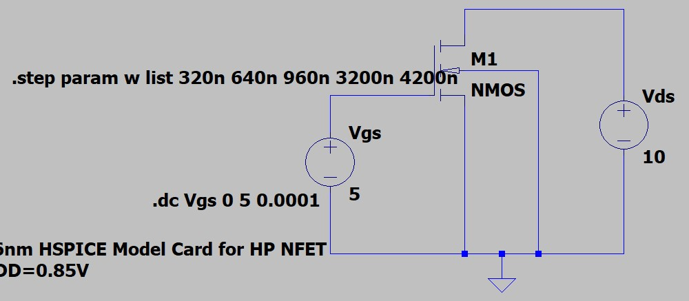
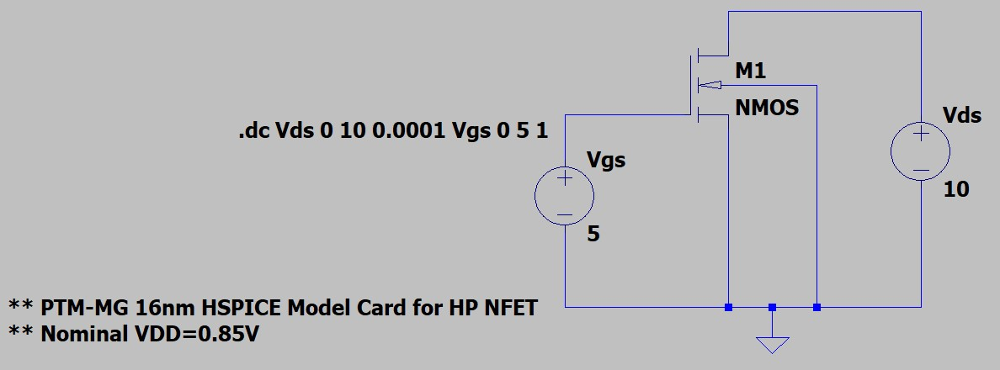
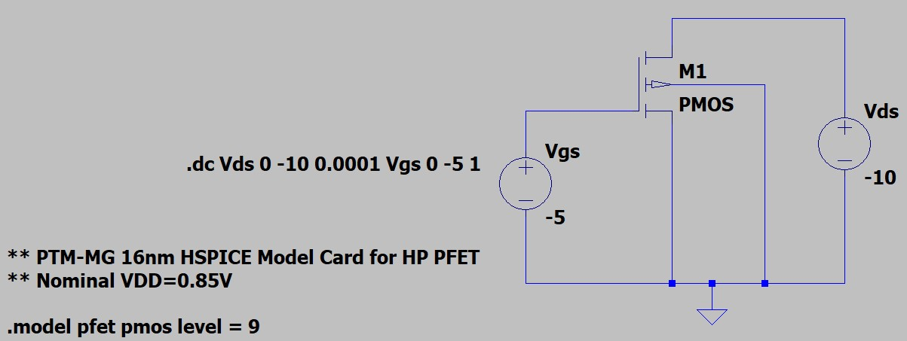

# Memory Design Workshop 2021

This repository reflects the work done in the lab sessions the Memory Design Workshop 2021 (MDW), offered by IEEE Banglore Section and IEEE CAS Banglore Chapter. The event was comprised of 5 days of lectures,2 in a day from Industry maestros and esteemed academicians, followed by self-paced hands-on lab session spanning over 2 weeks, aiming to familiarise ourselves with freeware tools, PDKs, Analog Design focusing on Memory Designs and Concepts.

## Table of Contents

- [About](#about)
- [Lab 1](#Lab-1)
- [Lab 2](#Lab-2)
- [Lab 3](#Lab-3)
- [Lab 4](#Lab-4)
- [Future Scope](#future-scope)

## About
This workshop presents a basic overview of different SRAM Cell Designs using [LTSpice](https://www.analog.com/en/design-center/design-tools-and-calculators/ltspice-simulator.html) and ASU's [Arizona State Predictive PDK (ASAP)](https://asap.asu.edu/) 14nm FinFET node, using an intuitive approach to designing a simple SRAM Cells. This workshop also provides deep insights into recent advancements and current research trends in Memory Cell Designs. Here I have uploaded all the works done by me in 4 lab sessions organized by this workshop.

## Lab 1
- Understand basic analysis types in LTSpice.
- Run an inverter transient and DC analysis.
- Assignment :
	- Calculate the power of a nominally sized inverter driving a load of 1fF/5fF.
	- Calculate Fan out of 1 (FO1) and Fan out of 4 (F04) delay of the nominally sized inverter at nominal and +/-10% supply.
	- Calculate the leakage power of a 50fin inverter and compare it with a 22nm planar FET inverter of the same width.

Schematic Diagram :
- NMOS: Id vs Vgs Schematic Diagram  
    
- NMOS: Id vs Vds Schematic Diagram    
    
- PMOS: Id vs Vgs Schematic Diagram    
    
- PMOS: Id vs Vds Schematic Diagram    
    

Resultant Waveform :
- NMOS: Id vs Vgs plots  
  
Different colors showing different values of Id when w = 320, 640, 960, 3200, 4200n  
- NMOS: Id vs Vds plots  
  
Different colors showing different values of Id when Vgs = 0, 1, 2, 3, 4, 5 V  
- PMOS: Id vs Vgs plots  
  
Different colors showing different values of Id when w = 320, 640, 960, 3200, 4200n  
- PMOS: Id vs Vds plots  
  
Different colors showing different values of Id when Vgs = 0, 1, 2, 3, 4, 5 V  
